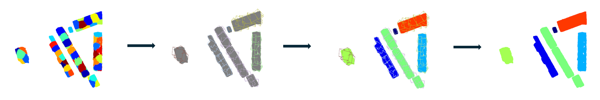

# 📄 – 02 Segmentierung der Gebäude

Im Rahmen der Gebäudedetektion aus 3D-Punktwolkendaten wurde ein Verfahren entwickelt, das auf einer Kombination aus Clustering, Hauptkomponentenanalyse (PCA) und geometrischer Adjazenzprüfung basiert. Ausgangspunkt ist eine grobe Vorsegmentierung der Punktwolke mittels KMeans, die auf räumlicher Verteilung und Scanrichtung basiert. Für jedes Cluster wird eine orientierte Bounding Box (OBB) berechnet, deren Ausrichtung durch eine PCA auf der XY-Ebene bestimmt wird. Zur Gruppierung angrenzender Strukturen werden potenziell zusammenhängende OBBs anhand ihrer 2D-Verschneidung (Intersection) analysiert und in einem Graphenmodell zusammengeführt. Die so entstandenen Reclump-Gruppen ermöglichen eine robustere Zusammenfassung von Gebäudeteilen, die im KMeans-Schritt getrennt wurden. Eine anschliessende Visualisierung zeigt die farblich codierten OBBs im Kontext der Punktwolke zur Qualitätssicherung und Interpretation der segmentierten 

